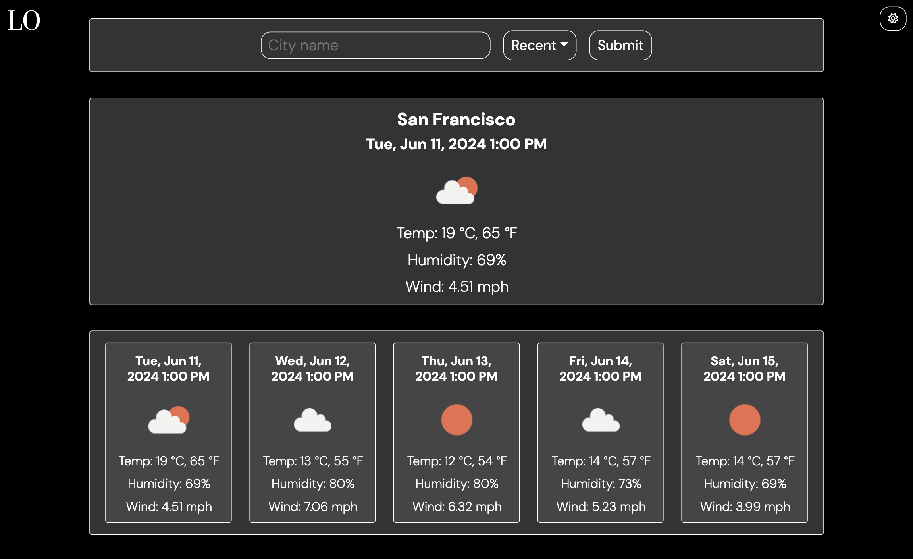
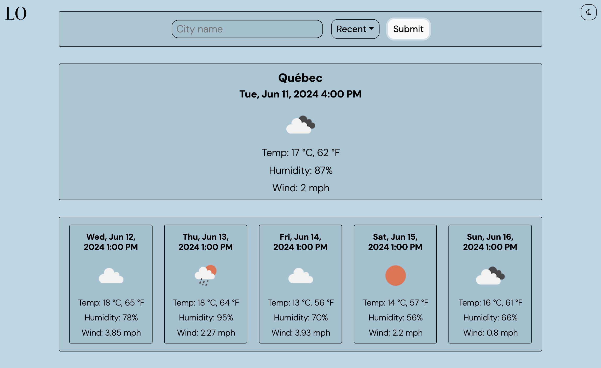
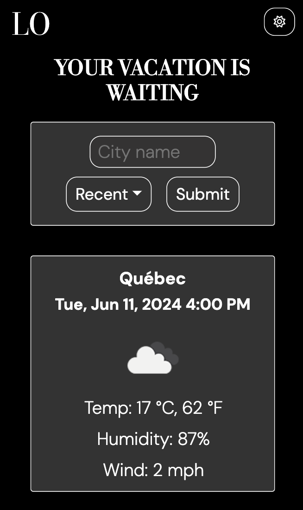
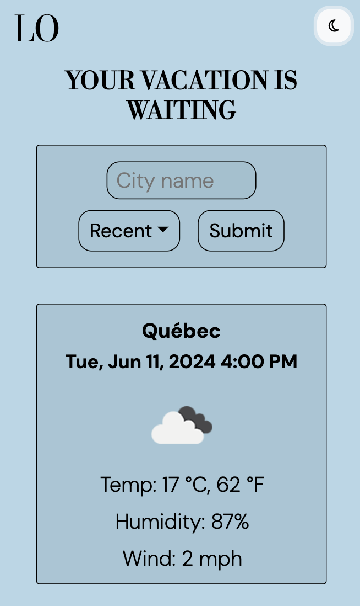

# Trip Planner

## Description

Visit this site at https://gcbel.github.io/cu-trip-planner/.

For this project, I created a page that allows users to search for an ideal vacation destination based on weather data. To do this, a user can search for a location and the page will populate with that city's weather information. Through this project, I had the opportunity to practice using vanilla Javascript and Bootstrap to create a responsive webpage that dynamically resizes into mobile and desktop layouts. I also worked with the Day.js and OpenWeather APIs to populate the page with local time information and weather details.

The final deployed desktop webpage in dark mode:

In light mode:

On mobile:

|  |  |  |  |
|------------------------------------------|-------------------------------------------|------------------------------------------|-------------------------------------------|

This project is based on this reference provided by the Columbia University Full-Stack Bootcamp.

## Installation

N/A

## Usage

Webpage can be viewed in any browser. The first page allows users to navigate to the weather page, either from an array of featured locations or from a blank slate (the "Let's adventure" button). On next page, users can view weather conditions for a city of their choosing for the following 5 days. Users will see the city name, the date, an icon representation of weather conditions, the temperature, the humidity, and the wind speed. Recent searches will be stored locally, and users can revisit any of their recent searches by looking through the dropdown menu "recents".

## Credits

CSS Reset (reset.css) file: https://meyerweb.com/eric/tools/css/reset/  
OpenWeather API for all weather information: https://openweathermap.org/api  
Day.JS API for all date information and timezone conversions: https://day.js.org/  
All photos are found from the free stock photo website Pexels, and all credit is given to the photographers: https://www.pexels.com/

## License

Please refer to the license in the repo.
