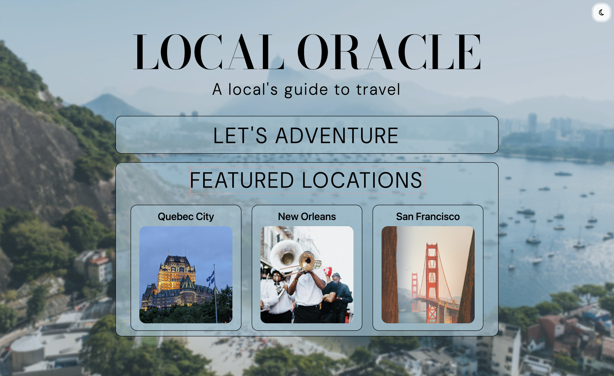

# Trip Planner

## Description

Visit this site at https://gcbel.github.io/cu-trip-planner/.

For this project, I created a page that allows users to search for an ideal vacation destination based on weather data. To do this, a user can search for a location and the page will populate with that city's weather information, including weather conditions, the temperature, the humidity, and the wind speed. Through this project, I had the opportunity to practice using vanilla Javascript, Bootstrap... to create a responsive webpage that dynamically resizes into mobile and desktop layouts.

The final deployed desktop webpage in dark mode:

In light mode:

This project is based on this reference provided by the Columbia University Full-Stack Bootcamp.

## Installation

N/A

## Usage

Webpage can be viewed in any browser. The first page allows users to... . Content will be stored locally.

## Credits

CSS Reset (reset.css) file: https://meyerweb.com/eric/tools/css/reset/  

## License

Please refer to the license in the repo.
